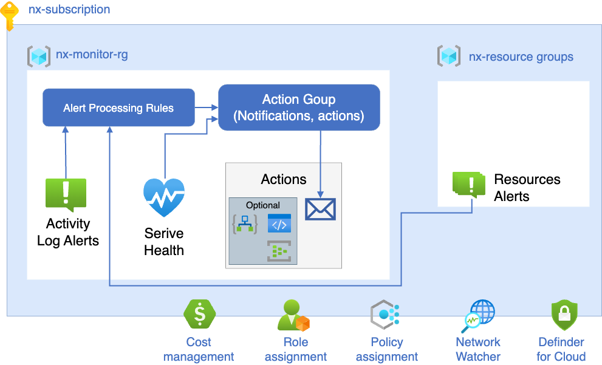

# caf-monitoring

## Approach
- Metric alerts are deployed with resources (in the same resource group)
- platform alerts like Service Health / Activity are created in a dedicated resource group for each subscription
- A single Action Group per subscription will be deployed. 
- Alert Processing Rules will target the Action Group in the subscription where the alert originated.
- LZ Alerts, Action Groups and Alert Processing Rules are deployed using Azure Polic

## Implenatation

### Alert Policy Definitions

* The following policy definition categories will be enabled:

- Resource Metrics.
- Service and Resource Health
- Activity Logs
- VM Insights Log Alerts

#### Resource Metrics
Resource Metric alerts are deployed in the same resource group as the created Azure resource. For example, a resource metric alert for Express Route will be created in the same resource group containing the Express Route Gateway. This is done because these alert types are related to the specific resource id, therefore it makes sense to link the alert to the resource in the same resource group.

#### Log Alerts
Log alerts are scoped at the subscription level. For the policies to remediate and deploy, the data which the alert queries for needs to exist in the Log Analytics table. For the virtual machine log alerts the VM insights solution needs to be enabled on the VMs that are targeted. Only the performance collection of the VM insights solution is required for the current alerts to deploy. To enable VM Insights. 

#### Service and Resource Health
Service health provides a personalized view of the health of the Azure services and regions you’re using. Resource health provides information about the health of your individual cloud resources such as a specific virtual machine instance.

Service and resource health events are written into the activity log. This means we can create a sub set of activity log alerts that can alert on health events. We create these alerts scoped to each subscription with four separate alerts for each of the four service health categories: Incident, Planned Maintenance, Security Advisories and Health Advisories. A resource health alert will be created for any resource that goes into an unavailable or degraded state which can be platform or user initiated. We will ignore if the state is unknown as this can lead to erroneous alerting.

### Alert Processing Rules

Alert Processing Rules enable the filtering of alerts and assign alerts to the appropriate action groups based on filter criteria. A  single Action Group per subscription, and deploy a single Alert Processing Rule without filters to action alerts via the Action Group. This may be revised in the future.

